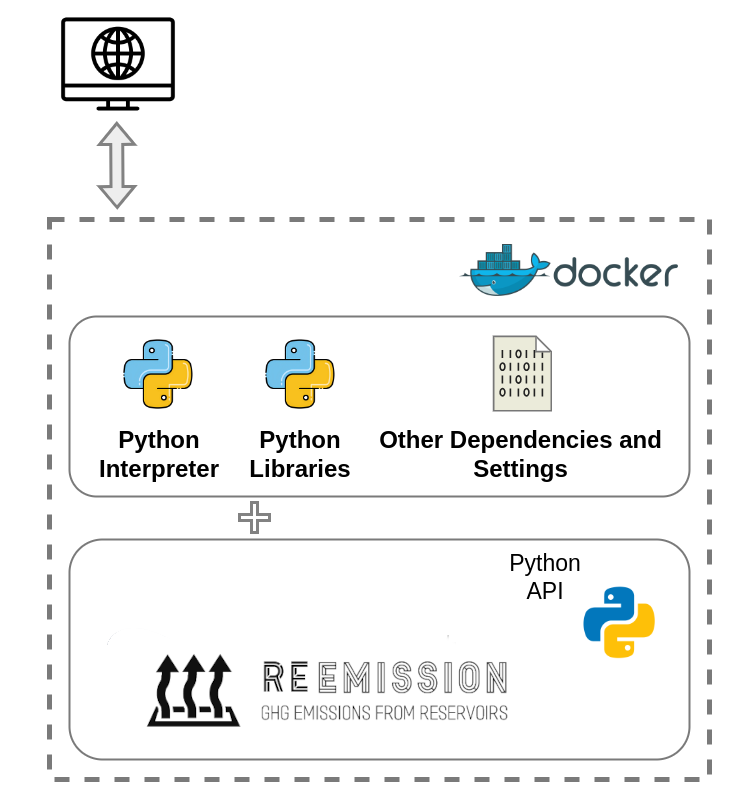

About Docker
============

.. _ReEmission: https://github.com/tomjanus/reemission

.. _What is Docker:

What is Docker?
---------------

Docker is a tool for packaging applications and their dependencies so they can run consistently on any computer. 
Think of it like a shipping container for software. Just as a shipping container can hold different items and be transported easily from place to place, Docker allows bundling application with everything they need to run and move it effortlessly between different computers or environments. This ensures that the application behaves the same way no matter where it's used, making it easier to develop, test, and deploy software.

In the context of our software, we "bundle" ReEmission_ together with everything that it needs to run, i.e. the *Python Interpreter* and additional *Python libraries* aka. dependencies that the source-code relies on. Once the Docker image has been built, it can run as a container on a computer without the user having to worry about unmet dependencies and library and Python version conflicts.

Docker Images and Docker Containers
-----------------------------------

You do not need to know the inner workings of Docker in order to use it to run ReEmission_.
Howver, it is worth understanding the two most important Docker concepts i.e. **Images** and **Containers**.

.. _What are Docker Images:

Docker Images
^^^^^^^^^^^^^

A *Docker image* is a template that contains all the necessary files and instructions required to run a *containerized* application: a base operating system, the application source code & any libraries, dependencies, and other resources needed to execute the application. It is like a snapshot of a software environment that you can use to create containers (see below). Think of it as a blueprint or a recipe for what the container should look like and how it should behave.

.. _What are Docker Containers:

Docker Containers
^^^^^^^^^^^^^^^^^

A *Docker container* is a running instance of a *Docker Image*. It is an isolated environment that contains all the necessary resources for the application to run. Think of it as a very lightweight virtual machine running on your host computer, with the application running inside it. When you run a *Docker Image*, it creates a container. Containers are the actual running environments where the application executes. They are isolated from the operating system on your personal computer, which ensures consistency and security.

In summary, a *Docker Image* is the definition of what your application and its environment should be, while a *Docker Container* is a running instance of that image.

