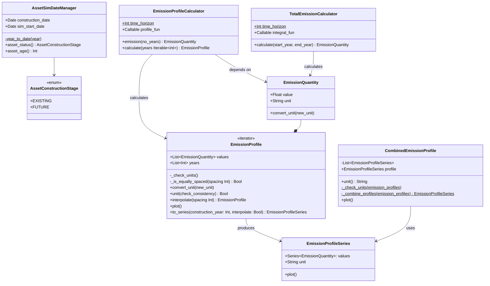

# Main source code of the RE-Emission package

#### profile.py
`profile.py` contains the functionality for creating emission profiles, adding profiles together, plotting individual and composite profiles from multiple reservoirs and calculating total emissions.

Features:
* Suport for storing emission values with units
* Calculation of emission profiles for time > time_horizon (100 years)
* Conversion of emission profiles to EmissionProfileSeries (using Pandas)
* Interpolation of emisison profiles, e.g. to create profiles with equally spaced years, e.g. at 1 year or 2 year time-steps.
* Addition of multiple profiles in `EmissionProfileSeries` format to.
* Plotting combined profiles from multiple reservoirs.

UML Diagram:

